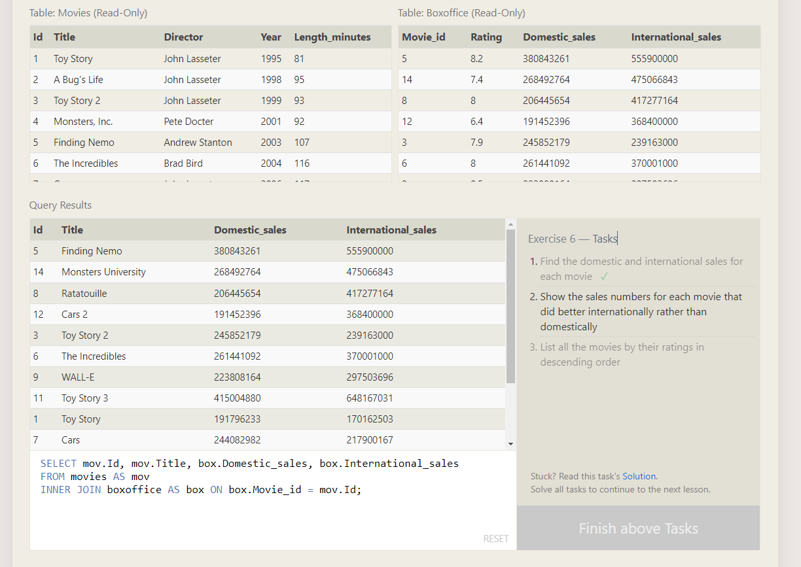
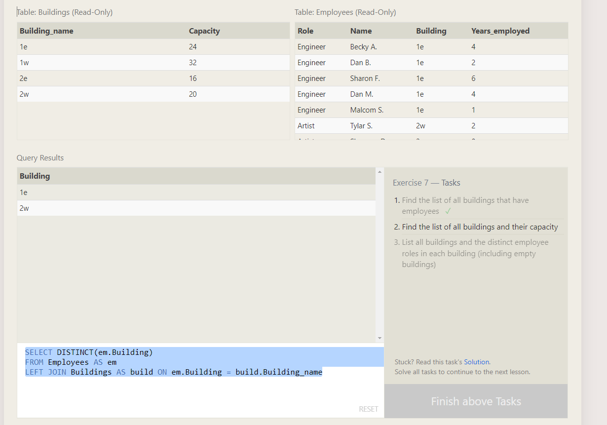

# TABLE JOINS

## INNER JOINS



```sql
SELECT mov.Id, mov.Title, box.Domestic_sales, box.International_sales
FROM movies AS mov
INNER JOIN boxoffice AS box ON box.Movie_id = mov.Id;

SELECT mov.Id, mov.Title, box.Domestic_sales, box.International_sales
FROM movies AS mov
INNER JOIN boxoffice AS box ON box.Movie_id = mov.Id
WHERE box.International_sales > box.Domestic_sales;

SELECT mov.Id, mov.Title, box.Rating, box.Domestic_sales, box.International_sales
FROM movies AS mov
INNER JOIN boxoffice AS box ON box.Movie_id = mov.Id
-- WHERE box.International_sales > box.Domestic_sales
ORDER BY box.Rating DESC;
```

## LEFT/RIGHT/FULL JOIN



```sql
SELECT DISTINCT(em.Building)
FROM Employees AS em
LEFT JOIN Buildings AS build ON em.Building = build.Building_name

SELECT build.Building_name, build.Capacity
FROM Buildings AS build;

SELECT DISTINCT(em.Role), build.Building_name
FROM Buildings AS build
LEFT JOIN Employees AS em ON build.Building_name = em.Building;
```